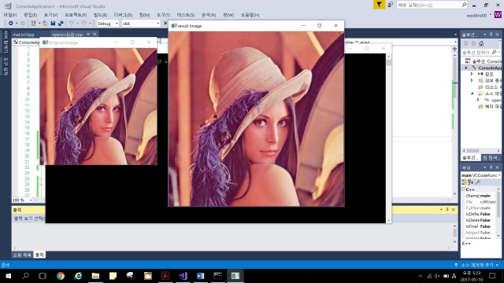
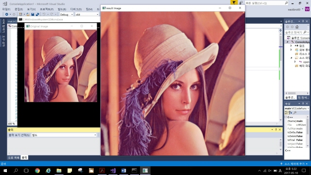

# Bilinear-Interpolation

### What language did you use?
- I used **OpenCV**.

### What is **Interpolation**?
- If the image is magnified N times, part of the new image value is replaced by an empty space. It is because those parts are fails to accept the value of the original image. As the number of cells grows, they could not be filled with original images. *Interpolation* is the technique of supplying these empty spaces.

### What is **Bilinear-Interpolation**?
- A *Bilinear interpolation* is a one of Interpolation method that infers the value by applying two lines of the x-axis and the y-axis. There are four dots which are two lines are meeting. The values of these four adjacent points are obtained by the weights of each of corresponding areas.

### Screenshot of filter effect
- Rate is 1.5/ 1.5

- 

- Rate is 2.0/ 2.0

- 
